# Research Assistant

An intelligent pipeline for processing research papers using LLMs (Ollama or Gemini) with **dynamic LLM-driven category generation**, accurate PDF parsing, metadata extraction, multi-category relevance scoring, deduplication, and automated summarization.

## Features

- **🤖 Dynamic LLM-Driven Taxonomy**: LLM generates categories from your research topic (no hardcoded categories!)
- **📊 Multi-Category Scoring**: Papers scored across ALL categories simultaneously for best-fit placement
- **🎯 Flexible LLM Support**: Use local Ollama models or Google Gemini API
- **🔧 Generic & Configurable**: Runtime topic and directory configuration (no hardcoding)
- **📄 Accurate PDF Parsing**: PyMuPDF + OCR fallback (ocrmypdf + Tesseract) + pdfminer.six
- **🔍 LLM-Based Metadata Extraction**: Extract titles, authors, abstracts, years using local or cloud LLMs
- **🔄 Smart Deduplication**: Exact (hash-based) and near-duplicate (MinHash-based) detection
- **⚡ Efficient API Usage**: 2 LLM calls per paper (metadata + classification)
- **📝 Topic-Focused Summaries**: Per-paper summaries with "how this helps your research"
- **💾 Resumable**: SQLite cache for embeddings and OCR outputs, index-based resume logic
- **📤 Multiple Outputs**: JSONL master index + CSV spreadsheet + Markdown summaries per category
- **✅ Comprehensive Testing**: 100+ unit and integration tests with 41%+ coverage

## Pipeline Flow (8 Passes)

```mermaid
graph TD
    A[📁 Input: PDF Directory + Topic] --> B[🤖 PASS 1: LLM Taxonomy Generation]
    B -->|Generate categories from topic ONLY| C[� PASS 2: Inventory PDFs]
    C -->|Discover all PDFs| D[🔍 PASS 3: Metadata + Classification]
    D -->|Extract metadata + Multi-category scoring| E{Readable?}
    E -->|No| F[� Move to need_human_element/]
    E -->|Yes| G{Topic Relevance?}
    G -->|< threshold| H[� Move to quarantined/]
    G -->|>= threshold| I[📁 PASS 4: Move to Best Category]
    I -->|Highest scoring category| J[🔄 PASS 5: Deduplication]
    J -->|MinHash LSH| K{Duplicate?}
    K -->|Yes| L[� Move to repeated/]
    K -->|No| M[📝 PASS 6: Update Manifests]
    M --> N[✍️ PASS 7: LLM Summarization]
    N -->|Topic-focused summaries| O[💾 PASS 8: Generate Index]
    O --> P[📊 index.csv]
    O --> Q[📋 index.jsonl]
    O --> R[📝 summaries/*.md]
    O --> S[📜 manifests/*.json]
    O --> T[🗂️ categories.json]
    
    style B fill:#e1f5ff
    style D fill:#e1f5ff
    style N fill:#e1f5ff
    style F fill:#ffe1e1
    style H fill:#ffe1e1
    style L fill:#ffe1e1
    style P fill:#e1ffe1
    style Q fill:#e1ffe1
    style R fill:#e1ffe1
    style S fill:#e1ffe1
    style T fill:#e1ffe1
```



## Architecture

```
research_assistant/
├── cli.py                  # Main CLI entry point (8-pass pipeline)
├── config.py               # Configuration and settings
├── core/
│   ├── taxonomy.py         # 🆕 LLM-based category generation from topic
│   ├── inventory.py        # Directory traversal and PDF discovery
│   ├── parser.py           # PDF text extraction (PyMuPDF + OCR)
│   ├── metadata.py         # LLM metadata extraction + multi-category scoring
│   ├── dedup.py            # MinHash near-duplicate detection
│   ├── embeddings.py       # Ollama embedding generation
│   ├── summarizer.py       # Topic-focused summary generation
│   ├── mover.py            # File moving with dynamic folder creation
│   ├── manifest.py         # Simplified category manifest tracking
│   └── outputs.py          # JSONL, CSV, and Markdown generation
├── utils/
│   ├── cache_manager.py    # SQLite-based caching
│   ├── llm_provider.py     # Unified Ollama/Gemini interface
│   ├── gemini_client.py    # Google Gemini API client
│   ├── hash.py             # Content hashing utilities
│   └── text.py             # Text normalization and processing
└── tests/                  # 100+ unit and integration tests
```

## Prerequisites

- **Python 3.10+**
- **LLM Provider** (choose one or both):
  - **Ollama** (local, free) with models:
    - `deepseek-r1:8b` (metadata extraction & classification)
    - `nomic-embed-text` (embeddings)
  - **Google Gemini API** (cloud, requires API key):
    - Set `GEMINI_API_KEY` environment variable
- **Tesseract** (for OCR): `brew install tesseract` (macOS) or `apt-get install tesseract-ocr` (Linux)

## Installation

```bash
# Clone or navigate to project
cd research_assistant

# Create virtual environment
python3 -m venv venv
source venv/bin/activate

# Install dependencies
pip install -r requirements.txt

# Option 1: Local Ollama (recommended for privacy/offline)
ollama pull deepseek-r1:8b
ollama pull nomic-embed-text

# Option 2: Gemini API (cloud-based)
# Create .env file with your API key:
echo "GEMINI_API_KEY=your_api_key_here" > .env
```

## Quick Start

```bash
# Basic usage with Gemini (recommended)
python cli.py process \
  --root-dir /path/to/papers \
  --topic "Prompt Injection Attacks in Large Language Models" \
  --llm-provider gemini \
  --workers 2

# With Ollama (local, requires models installed)
python cli.py process \
  --root-dir /path/to/papers \
  --topic "Your research topic" \
  --llm-provider ollama \
  --workers 2

# Custom topic relevance threshold (default: 5/10)
python cli.py process \
  --root-dir /path/to/papers \
  --topic "Your research topic" \
  --min-topic-relevance 7

# Resume from interrupted run (skips analyzed papers)
python cli.py process \
  --root-dir /path/to/papers \
  --topic "Your research topic" \
  --resume

# Force regenerate categories (ignore cached taxonomy)
python cli.py process \
  --root-dir /path/to/papers \
  --topic "Your research topic" \
  --force-regenerate-categories

# Dry-run (no file moves)
python cli.py process \
  --root-dir /path/to/papers \
  --topic "Your research topic" \
  --dry-run
```

## Configuration

Runtime configuration via CLI flags or `config.yaml`:

```yaml
# config.yaml (optional)
llm_provider: gemini  # or 'ollama'

# Scoring thresholds
scoring:
  min_topic_relevance: 5  # Papers below this go to quarantined/ (1-10 scale)

# Deduplication
dedup:
  similarity_threshold: 0.95
  use_minhash: true
  num_perm: 128

# LLM providers
ollama:
  summarize_model: "deepseek-r1:8b"
  classify_model: "deepseek-r1:8b"
  embed_model: "nomic-embed-text"
  temperature: 0.1
  base_url: "http://localhost:11434"

gemini:
  api_key: null  # Set via GEMINI_API_KEY environment variable
  temperature: 0.1

# Metadata enrichment
crossref:
  enabled: true
  email: "your.email@domain.com"  # Polite pool (optional)

# File organization
move:
  enabled: true
  track_manifest: true
  create_symlinks: false

# Processing
processing:
  workers: 2  # Parallel workers (recommend 2 for API rate limits)
  batch_size: 32
```

## Dynamic Category Generation

**How it works**:

1. **LLM generates categories from topic ONLY** (no papers analyzed yet)
   - Example topic: "Prompt Injection Attacks in Large Language Models"
   - LLM generates 10-15 relevant categories with definitions
   - Cached in `outputs/categories.json` and `cache/categories.json`

2. **Multi-category scoring** for each paper:
   - Paper scored against ALL categories simultaneously (1-10 scale)
   - Returns: `topic_relevance`, `category_scores` dict, `reasoning`
   - Paper placed in highest-scoring category

3. **Topic relevance filtering**:
   - Papers with `topic_relevance < threshold` → `quarantined/`
   - Configurable via `--min-topic-relevance` (default: 5/10)

**Example Categories Generated**:
```json
{
  "attack_vectors": "Papers describing methods to perform prompt injection...",
  "defense_mechanisms": "Papers proposing techniques to defend against...",
  "detection_methods": "Papers focusing on identifying attacks...",
  "robustness_evaluation": "Papers developing metrics and benchmarks..."
}
```

## Manifest System & Resume Logic

**Manifest Structure** (per category):
- Tracks all papers in this category
- Stores classification reasoning and scores
- Enables resume functionality

**Manifest Entry**:
```json
{
  "paper_id": "abc123def456...",
  "title": "Defending Against Prompt Injection Attacks",
  "path": "defense_mechanisms/smith2023.pdf",
  "content_hash": "sha256:...",
  "classification_reasoning": "Paper focuses on input validation...",
  "relevance_score": 9,
  "topic_relevance": 8,
  "analyzed": true
}
```

**Resume Logic**:
- Checks `index.jsonl` for papers with `analyzed: true`
- Skips re-processing, loads from cache
- More efficient than re-running entire pipeline

## Output Structure

```
outputs/
├── categories.json          # 🆕 LLM-generated taxonomy with definitions
├── index.jsonl              # Full machine-readable index
├── index.csv                # Spreadsheet with all metadata
├── summaries/
│   ├── attack_vectors.md    # 🆕 Dynamic category names
│   ├── defense_mechanisms.md
│   ├── quarantined.md
│   └── ...
├── logs/
│   └── pipeline_YYYYMMDD_HHMMSS.log  # Detailed execution log
└── manifests/
    ├── attack_vectors.manifest.json  # 🆕 Dynamic categories
    ├── defense_mechanisms.manifest.json
    ├── quarantined.manifest.json
    ├── repeated.manifest.json
    └── need_human_element.manifest.json
```

## Index Fields (JSONL/CSV)

**New fields**:
- `paper_id`: Unique identifier (content hash)
- `title`, `authors`, `year`, `venue`, `doi`, `bibtex`
- `category`: Final category (best-fit from LLM scoring)
- `topic_relevance`: 1-10 relevance to research topic
- `category_scores`: JSON dict with scores for ALL categories
- `reasoning`: LLM explanation for categorization
- `duplicate_of`: Paper ID if duplicate
- `is_duplicate`: Boolean flag
- `path`: Current file path
- `summary_file`: Link to markdown summary
- `analyzed`: Boolean (true when processing complete)

**Removed fields** (from old system):
- `original_category` - No longer tracked (papers start in flat directory)
- `status` - Replaced by explicit category placement
- `include` - Replaced by topic_relevance threshold

## Advanced Usage

### Custom topic relevance threshold
```bash
# Stricter filtering (only highly relevant papers)
python cli.py process \
  --root-dir ./papers \
  --topic "..." \
  --min-topic-relevance 7

# More permissive (include more papers)
python cli.py process \
  --root-dir ./papers \
  --topic "..." \
  --min-topic-relevance 3
```

### Working with cached categories
```bash
# Use cached taxonomy (fast)
python cli.py process --root-dir ./papers --topic "..." --resume

# Force regenerate taxonomy (if topic changed)
python cli.py process \
  --root-dir ./papers \
  --topic "..." \
  --force-regenerate-categories
```

### Parallel processing
```bash
# More workers (caution: may hit API rate limits)
python cli.py process \
  --root-dir ./papers \
  --topic "..." \
  --workers 4

# Recommended for Gemini free tier (15 RPM limit)
python cli.py process \
  --root-dir ./papers \
  --topic "..." \
  --workers 2
```

## Troubleshooting

### OCR failing
```bash
# Verify Tesseract installation
tesseract --version

# Install additional language packs if needed
brew install tesseract-lang
```

### Ollama connection issues
```bash
# Check Ollama is running
ollama list

# Restart Ollama service
brew services restart ollama
```

## Performance Tips

- **Parallel processing**: Set `--workers 4` for multiprocessing
- **Cache warming**: Run inventory + parsing first, then scoring/summarization
- **Selective OCR**: Skip OCR for born-digital PDFs (auto-detected)
- **Batch embeddings**: Automatically batched in groups of 64

## License

MIT

# Gemini API support (optional)
# 1. Get your API key from https://aistudio.google.com/app/apikey
# 2. Add GEMINI_API_KEY to your .env file (see .env.example)

# Use Gemini as LLM provider
# python cli.py process \
#   --root-dir /path/to/papers \
#   --topic "Your research topic" \
#   --llm-provider gemini

# LLM provider selection in config.yaml
# llm_provider: ollama  # or 'gemini'
# gemini:
#   api_key: "${GEMINI_API_KEY}"
