# Research Assistant

An intelligent pipeline for processing research papers using LLMs (Ollama or Gemini), accurate PDF parsing, metadata extraction, relevance scoring, deduplication, and automated summarization.

## Features

- **Flexible LLM Support**: Use local Ollama models or Google Gemini API
- **Generic & Configurable**: Runtime topic and directory configuration (no hardcoding)
- **Accurate PDF Parsing**: PyMuPDF + OCR fallback (ocrmypdf + Tesseract) + pdfminer.six
- **LLM-Based Metadata Extraction**: Extract titles, authors, abstracts, years using local or cloud LLMs
- **Smart Deduplication**: Exact (hash-based) and near-duplicate (MinHash-based) detection
- **Relevance Scoring**: LLM-based scoring (0-10) with category assignment and inclusion decision
- **Category Validation**: LLM-based recategorization with confidence tracking
- **Topic-Focused Summaries**: Per-paper summaries with "how this helps your research"
- **Move Tracking**: Manifest per category prevents duplicate analysis after recategorization
- **Resumable**: SQLite cache for embeddings and OCR outputs
- **Multiple Outputs**: JSONL master index + CSV spreadsheet + Markdown summaries per category
- **Comprehensive Testing**: 100+ unit and integration tests with 41%+ coverage

## Pipeline Flow

```mermaid
graph TD
    A[📁 Input: PDF Directory] --> B[📋 Stage 1: Inventory]
    B -->|Discover all PDFs & categories| C[📄 Stage 2: Parse & Extract Text]
    C -->|PyMuPDF + OCR fallback| D[🤖 Stage 3: LLM Metadata Extraction]
    D -->|Title, authors, abstract, year| E[🔍 Stage 4: Deduplication]
    E -->|Exact hash + MinHash LSH| F{Duplicate?}
    F -->|Yes| G[📦 Move to repeated/]
    F -->|No| H[🎯 Stage 5: LLM Scoring & Categorization]
    H -->|Relevance 0-10 + category| I{Include?}
    I -->|Score < threshold| J[🚫 Move to quarantined/]
    I -->|Score >= threshold| K[📝 Stage 6: LLM Summarization]
    K -->|Topic-focused summaries| L[💾 Stage 7: Output Generation]
    L --> M[📊 index.csv]
    L --> N[📋 index.jsonl]
    L --> O[📝 summaries/*.md]
    L --> P[📜 manifests/*.json]
    
    style D fill:#e1f5ff
    style H fill:#e1f5ff
    style K fill:#e1f5ff
    style G fill:#ffe1e1
    style J fill:#ffe1e1
    style M fill:#e1ffe1
    style N fill:#e1ffe1
    style O fill:#e1ffe1
    style P fill:#e1ffe1
```



## Architecture

```
research_assistant/
├── cli.py                  # Main CLI entry point
├── config.py               # Configuration and settings
├── core/
│   ├── inventory.py        # Directory traversal and PDF discovery
│   ├── parser.py           # PDF text extraction (PyMuPDF + OCR)
│   ├── metadata.py         # LLM-based metadata extraction
│   ├── dedup.py            # MinHash near-duplicate detection
│   ├── embeddings.py       # Ollama embedding generation
│   ├── scoring.py          # LLM-based relevance scoring
│   ├── classifier.py       # LLM-based category validation
│   ├── summarizer.py       # Topic-focused summary generation
│   ├── mover.py            # File moving with manifest tracking
│   ├── manifest.py         # Category manifest tracking
│   └── outputs.py          # JSONL, CSV, and Markdown generation
├── utils/
│   ├── cache_manager.py    # SQLite-based caching
│   ├── llm_provider.py     # Unified Ollama/Gemini interface
│   ├── gemini_client.py    # Google Gemini API client
│   ├── hash.py             # Content hashing utilities
│   └── text.py             # Text normalization and processing
└── tests/                  # 100+ unit and integration tests
```

## Prerequisites

- **Python 3.10+**
- **LLM Provider** (choose one or both):
  - **Ollama** (local, free) with models:
    - `deepseek-r1:8b` (metadata extraction & classification)
    - `nomic-embed-text` (embeddings)
  - **Google Gemini API** (cloud, requires API key):
    - Set `GEMINI_API_KEY` environment variable
- **Tesseract** (for OCR): `brew install tesseract` (macOS) or `apt-get install tesseract-ocr` (Linux)

## Installation

```bash
# Clone or navigate to project
cd research_assistant

# Create virtual environment
python3 -m venv venv
source venv/bin/activate

# Install dependencies
pip install -r requirements.txt

# Option 1: Local Ollama (recommended for privacy/offline)
ollama pull deepseek-r1:8b
ollama pull nomic-embed-text

# Option 2: Gemini API (cloud-based)
# Create .env file with your API key:
echo "GEMINI_API_KEY=your_api_key_here" > .env
```

## Quick Start

```bash
# Run with Ollama (local)
python cli.py process \
  --root-dir /path/to/papers \
  --topic "Your research topic description here" \
  --llm-provider ollama \
  --output-dir ./outputs \
  --cache-dir ./cache

# Run with Gemini (requires GEMINI_API_KEY in .env)
python cli.py process \
  --root-dir /path/to/papers \
  --topic "Your research topic" \
  --llm-provider gemini

# Dry-run (no file moves)
python cli.py process \
  --root-dir /path/to/papers \
  --topic "Your research topic" \
  --llm-provider ollama \
  --dry-run

# Resume a previous run (uses cached results)
python cli.py process \
  --root-dir /path/to/papers \
  --topic "Your research topic" \
  --llm-provider ollama \
  --resume
```

## Configuration

Runtime configuration via CLI flags or `config.yaml`:

```yaml
# config.yaml (optional)
llm_provider: ollama  # or 'gemini'
relevance_threshold: 7.0  # Include papers with score >= 7.0
dedup_similarity: 0.95    # Near-duplicate threshold
ollama:
  summarize_model: "deepseek-r1:8b"
  classify_model: "deepseek-r1:8b"
  embed_model: "nomic-embed-text"
  temperature: 0.1
gemini:
  api_key: null  # Set via GEMINI_API_KEY environment variable
  model: "gemini-2.0-flash-exp"
  temperature: 0.1
crossref:
  enabled: true
  email: "your.email@domain.com"  # Polite pool (optional)
move:
  enabled: true
  track_manifest: true
```

## Move Tracking & Manifest System

**Problem**: If a paper is moved from `CategoryA/` to `CategoryB/` during analysis, we must ensure it's not analyzed twice.

**Solution**: Each category maintains a `.manifest.json`:
- Tracks all papers ever analyzed in this category (by content hash)
- Records move history (from/to, timestamp, reason)
- On processing, skip papers already in manifest with status "moved_out"
- When moving a paper in, add to destination manifest with status "moved_in" and link to original

**Manifest Entry Example**:
```json
{
  "paper_id": "abc123def456...",
  "original_path": "CategoryA/smith2023.pdf",
  "current_path": "CategoryB/smith2023.pdf",
  "status": "moved_in",
  "moved_from": "CategoryA",
  "moved_at": "2025-11-09T14:23:00Z",
  "reason": "Better fit for CategoryB based on content",
  "analyzed": true
}
```

## Output Structure

```
outputs/
├── index.jsonl              # Full machine-readable index
├── index.csv                # Spreadsheet with all metadata
├── summaries/
│   ├── CategoryA.md         # Summaries for all papers in CategoryA
│   ├── CategoryB.md
│   └── ...
├── logs/
│   ├── pipeline.log         # Detailed execution log
│   └── moves.log            # All file moves with reasons
└── manifests/
    ├── CategoryA.manifest.json
    ├── CategoryB.manifest.json
    └── ...
```

## CSV Columns

- `paper_id`: Unique identifier (content hash)
- `title`, `authors`, `year`, `venue`, `doi`
- `bibtex`: Complete BibTeX citation
- `category`: Current category
- `original_category`: Initial category from folder
- `relevance_score`: 0-10 relevance to topic
- `include`: Boolean for inclusion in research
- `duplicate_of`: Paper ID if this is a duplicate
- `is_duplicate`: Boolean flag
- `status`: `active`, `duplicate`, `quarantined`, `moved`
- `original_path`, `current_path`
- `summary_file`: Link to markdown summary
- `notes`: Additional information

## Advanced Usage

### Resume from specific stage
```bash
python cli.py process --root-dir ./papers --topic "..." --start-from embeddings
```

### Custom thresholds
```bash
python cli.py process \
  --root-dir ./papers \
  --topic "..." \
  --relevance-threshold 7.0 \
  --dedup-threshold 0.98
```

### Export only (skip analysis)
```bash
python cli.py export --cache-dir ./cache --output-dir ./outputs
```

## Troubleshooting

### OCR failing
```bash
# Verify Tesseract installation
tesseract --version

# Install additional language packs if needed
brew install tesseract-lang
```

### Ollama connection issues
```bash
# Check Ollama is running
ollama list

# Restart Ollama service
brew services restart ollama
```

## Performance Tips

- **Parallel processing**: Set `--workers 4` for multiprocessing
- **Cache warming**: Run inventory + parsing first, then scoring/summarization
- **Selective OCR**: Skip OCR for born-digital PDFs (auto-detected)
- **Batch embeddings**: Automatically batched in groups of 64

## License

MIT

# Gemini API support (optional)
# 1. Get your API key from https://aistudio.google.com/app/apikey
# 2. Add GEMINI_API_KEY to your .env file (see .env.example)

# Use Gemini as LLM provider
# python cli.py process \
#   --root-dir /path/to/papers \
#   --topic "Your research topic" \
#   --llm-provider gemini

# LLM provider selection in config.yaml
# llm_provider: ollama  # or 'gemini'
# gemini:
#   api_key: "${GEMINI_API_KEY}"
